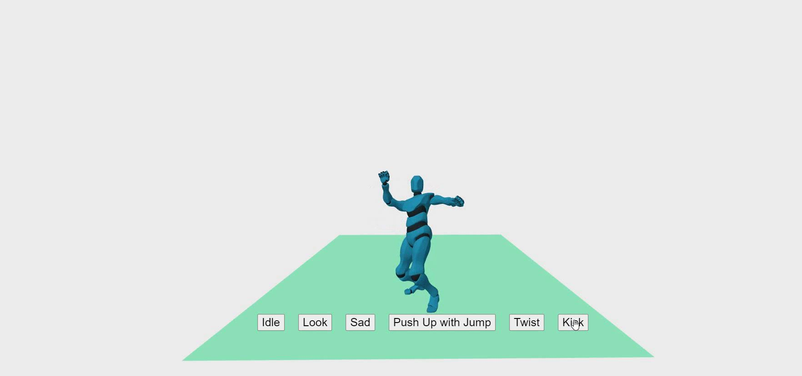

# AFrame GLTF Animations in the Runtime

### **Description / Rationale**
This is a project, which demonstrates the possibility of adding animations to 3D models (gltf/glb) in the runtime. The project was inspired by Henry Egloff's blog article <a href="https://henryegloff.com/how-to-load-gltf-animations-as-separate-files-in-three-js/">"How to Load GLTF Animations as Separate Files in Three.js"</a>.  

### **Instructions**
To see the project at work just copy the repository to your local server and explore all the functionality. 
Animations can be downloaded separately from <a href="https://www.mixamo.com/#/">mixamo.com</a>. 

<b>Please note</b>: Downloaded animations are in .fbx format. They need to be converted to binary GLTF (.glb) files using Blender. While doing so, make sure to: rename the animation; save the file with the same name as animation.   

### **Tech Stack**
The project is powered by AFrame and Three.js

### **Demo**
To see the application at work: [Demo application](https://gltfanimations-runtime.glitch.me/)
